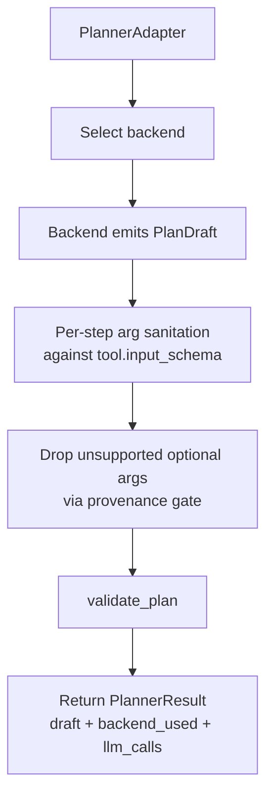

# Factory Agent Pipeline (Current)

This is the current end-to-end runtime flow for `factory-agent`, from user input to plan execution, approval, recovery, and completion.

## End-to-end flow

```mermaid
flowchart TD
    A[User message / create plan] --> B[API router + session context<br/>agent/api.py]
    B --> C{Intent kind}
    C -- conversation --> C1[Assistant reply only<br/>Persist empty completed plan]
    C -- operations --> D[Load + health-check tool registry]
    D --> E[Scope tools for intent<br/>filter_tools_for_intent]
    E --> F[PlannerAdapter.generate_plan]

    F --> G{planner_backend}
    G -- structured --> G1[StructuredPlannerBackend]
    G -- langchain --> G2[LangChainPlannerBackend]
    G -- legacy/default --> G3[LegacyPlannerBackend]
    G1 -. error + fallback enabled .-> G3
    G2 -. error + fallback enabled .-> G3
    G1 --> H
    G2 --> H
    G3 --> H

    H[Universal hardening<br/>schema sanitize + provenance strip + validate_plan]
    H --> I[Persist Plan + PlanStep rows<br/>plan hash + idempotency keys]
    I --> J{mode}
    J -- plan/discovery --> K[Optional discovery->execution promotion]
    J -- execute --> L
    K --> L[ExecutionEngine.execute_session]

    L --> M{Next step}
    M --> N{requires_approval}
    N -- yes --> O[Preflight probe (some write tools)<br/>then create/wait approval]
    O --> P{approval status}
    P -- pending --> P1[Session WAITING_APPROVAL]
    P -- rejected --> P2[Step SKIPPED, session IDLE]
    P -- approved --> Q[Execute tool call]
    N -- no --> Q

    Q --> R{execution outcome}
    R -- done --> S[Persist result + summary + metrics]
    R -- retry --> T[Backoff retry loop]
    R -- replan --> U[Trigger replan]
    R -- ambiguous --> V[Session BLOCKED + DLQ push]
    R -- fail_hard --> W[Session FAILED]

    S --> X{more steps}
    X -- yes --> M
    X -- no --> Y[Plan COMPLETED + Session COMPLETED]
```

## Detailed step breakdown (each step)

### Step 1: Receive request + load session (`agent/api.py`)
- Trigger: user sends message or plan request.
- Inputs: `session_id`, user message, mode (`plan` vs `execute`), auth context.
- Core logic: load session, append `MessageRow` (role=`user`), normalize context.
- Output: active session context ready for intent handling.
- State changes: session version/message history update.
- Main branches:
  - unknown session -> HTTP error.
  - mid-execution message can set `pending_user_message` and cause later replan.

### Step 2: Intent assessment (`agent/intent.py` used from API)
- Trigger: after message ingest.
- Inputs: latest user text.
- Core logic: classify request as operations vs conversation.
- Output:
  - conversation reply path, or
  - operations path.
- State changes: none mandatory; route decision controls later writes.
- Main branches:
  - non-operations: assistant reply persisted as empty completed plan.
  - operations: continue to tool pipeline.

### Step 3: Tool registry load + health gate (`agent/api.py`, `agent/tool_registry.py`)
- Trigger: operations intent.
- Inputs: DB tool catalog, env flags (`enforce_tool_registry_health`, auto-repair).
- Core logic: load tools, assess registry quality, optionally regenerate from OpenAPI/local swagger.
- Output: `tools_by_name`.
- State changes: possible tool-registry refresh writes.
- Main branches:
  - healthy registry -> continue.
  - unhealthy + repair fails -> `503`.

### Step 4: Tool scoping (`agent/tool_scope.py`)
- Trigger: tools available.
- Inputs: intent text + full tool set.
- Core logic:
  - tokenize intent and tool metadata,
  - score each tool (`score_tool`),
  - split compound intent into clauses,
  - select top scoped set.
- Output: scoped tool names (candidate set for planner).
- RBAC gate: before scoping/planning, Python filters tools by the active user role from JWT/header claims so disallowed tools are never shown to the planner.
- State changes: none.
- Main branches:
  - no good matches -> planner usually clarifies/fails safely.

### Step 5: Planner backend routing (`PlannerAdapter` in `agent/planner.py`)
- Trigger: scoped tools available.
- Inputs: intent, scoped tools, optional context, config `planner_backend`.
- Core logic:
  - choose `structured` / `langchain` / `legacy`,
  - apply backend-specific generation,
  - fallback to `legacy` when enabled.
- Output: `PlannerResult` (`draft`, `backend_used`, `llm_calls`, optional contract).
- State changes: telemetry/logging, possible LLM call counters.
- Main branches:
  - backend error + fallback true -> legacy fallback.
  - backend error + fallback false -> raise planner error.

### Step 6: Backend plan generation details (`agent/planner.py`)
- `legacy`:
  - deterministic arg extraction (IDs, quantity, deadlines, notes),
  - reasoning selection, enum checks, clarification or confirmation when unsafe.
- `langchain`:
  - attempt structured output first,
  - then JSON-only repair parse,
  - then legacy fallback.
- `structured`:
  - model returns strict JSON payload with evidence/missing fields,
  - Python rebuilds `PlanDraft`, rejects invalid/missing unsafe cases.
- Output for all: candidate `PlanDraft` only (not executed yet).

### Step 7: Universal hardening + validation (`agent/planner.py`, `agent/plan_validator.py`)
- Trigger: backend returned candidate draft.
- Inputs: candidate steps + tool schemas.
- Core logic:
  - sanitize args strictly to schema-supported fields,
  - strip unsupported optional args by provenance checks,
  - enforce required-arg policy (approval-gated writes can be partially filled),
  - validate dependency graph, parallel safety, step limits, tool existence.
  - validate typed result bindings against prior tool response schemas.
  - require approval-gated bounded execution for `foreach` bulk writes.
- Output: safe validated draft.
- State changes: contract annotations/log events for stripped fields.
- Main branches:
  - ambiguous/unsupported enum -> clarification error.
  - ambiguous free-text filters -> evidence-backed confirmation with primary matching fields and `other_possible_fields`.
  - invalid graph/schema -> planner/backend error.

### Step 8: Persist plan and steps (`_persist_plan` in `agent/api.py`)
- Trigger: validated plan draft.
- Inputs: draft, `tools_by_name`, session, intent.
- Core logic:
  - invalidate previous active plan for session (if any),
  - create `PlanRow` with `plan_hash`, dependencies, parallel groups,
  - create `PlanStepRow` records in order,
  - compute per-step `idempotency_key`,
  - summarize plan for assistant response.
- Output: stored plan + plan response payload.
- State changes:
  - session -> `PLANNING` (or `IDLE` if empty plan),
  - `plan_id`, `plan_version`, `current_step_index` reset.

### Step 9: Discovery mode promotion (optional)
- Trigger: request mode indicates planning/discovery flow.
- Inputs: discovery plan and session state.
- Core logic: optional conversion to execution plan path (including plan approvals where used).
- Output: executable plan context.
- State changes: plan kind/status and possible approval rows.

### Step 10: Step scheduler loop (`ExecutionEngine.execute_session` in `agent/execution.py`)
- Trigger: execute requested.
- Inputs: current plan, ordered steps, session cursor.
- Core logic:
  - fetch next not-complete step by `current_step_index`,
  - enforce session limits (steps/replans/LLM/duration),
  - claim step lock before running.
- Output: next step action decision.
- State changes: step `IN_PROGRESS`, session `EXECUTING`.
- Main branches:
  - lock conflict -> replan/repair path.
  - pending user interruption -> replan.

### Step 11: Approval gate per step (`agent/execution.py` + approvals endpoints)
- Trigger: step tool has `requires_approval=true`.
- Inputs: step args/tool metadata/approval status.
- Core logic:
  - optional preflight probe for some write endpoints (`PUT/PATCH/DELETE` with `{id}`),
  - create `ApprovalRow` when needed,
  - pause until approved.
- Output:
  - pending -> execution pauses,
  - approved -> continue,
  - rejected -> step skipped and session set to idle/error.
- State changes:
  - session `WAITING_APPROVAL`,
  - approval decision timestamps and actor fields.

### Step 12: Tool execution + idempotency (`_execute_tool_call` path in `agent/execution.py`)
- Trigger: step ready to run (approval satisfied or not required).
- Inputs: tool endpoint/method, normalized args, idempotency key, plan hash.
- Core logic:
  - check prior `ExecutionSnapshot` for replay,
  - otherwise invoke tool HTTP call,
  - store snapshot + response.
- Output: raw tool result body + status.
- State changes: step result payload and execution telemetry.
- Main branches:
  - replay hit -> skip remote call.
  - 404 read-only soft case -> done with not-found summary.

### Step 13: Post-result verification + summarization
- Trigger: tool result obtained.
- Inputs: response body + predicate contract.
- Core logic:
  - verify predicate coverage,
  - attempt repair loop for empty ambiguous filtered GETs,
  - generate deterministic or LLM-assisted operator summary,
  - append assistant tool-result message.
- Output: finalized step result/summary.
- State changes: step `DONE`, timestamps, session step counters, metrics.

### Step 14: Error classification and recovery
- Trigger: any step exception.
- Inputs: exception type/status + step/tool context.
- Core logic: classify into `RETRY`, `REPLAN`, `AMBIGUOUS`, `FAIL_HARD`.
- Output branches:
  - `RETRY`: exponential backoff, retry_count increment.
  - `REPLAN`: invalidate path and build new plan.
  - `AMBIGUOUS`: mark `BLOCKED`, push `DeadLetterRow`.
  - `FAIL_HARD`: mark failed and stop.
- State changes: session/step status + DLQ/metrics updates.

### Step 15: Completion + closeout
- Trigger: all steps terminal (`DONE`/`SKIPPED` as applicable).
- Inputs: final session/plan state.
- Core logic:
  - mark plan `COMPLETED`,
  - mark session `COMPLETED`,
  - emit completion message if needed,
  - emit metrics/events.
- Output: execution result with terminal state.
- State changes: completion timestamps, counters, final assistant message.

## Planner internals (detailed)



### Backend specifics

1. `legacy`  
   Heuristic + reasoning pipeline selection (`ReasoningPipeline.select_tool`), deterministic required-arg extraction from intent, clause splitting for compound intents, enum/value checks, live predicate evidence lookup for ambiguous read filters, and clarification/confirmation paths when mapping is unsafe.

2. `langchain`  
   Two-pass strategy:
   - pass 1: structured output (`with_structured_output(PlanDraft)`),
   - pass 2: JSON repair parse.
   If both fail, it falls back to `legacy` inside the backend path.

3. `structured`  
   Prompts model to return strict JSON plan payload with evidence and missing-required fields; Python then rebuilds safe `PlanDraft`, strips unsupported args, enforces schema, and validates final graph.

## Approval lifecycle

1. Planning can include approval-gated tools (`requires_approval=true`) even when some args are missing (intended to be completed at approval time).  
2. During execution, approval rows are created per gated step (or plan-level in specific flows).  
3. `/approvals/{id}/approve` may also update step args (validated against tool schema) before execution continues.  
4. Rejection marks step skipped (when applicable) and returns session to `IDLE` with rejection reason.

## Execution decision model

The engine classifies failures into:

- `RETRY`: transient, uses exponential backoff.  
- `REPLAN`: mismatch/conflict/contract issue, invalidates current path and regenerates plan.  
- `AMBIGUOUS`: unsafe uncertain state, session becomes `BLOCKED`, DLQ entry created.  
- `FAIL_HARD`: unrecoverable, session marked `FAILED`.

It also supports:

- idempotent replay via `ExecutionSnapshot` + `idempotency_key`,  
- per-item idempotency and progress state for bounded `foreach` bulk steps,
- predicate contract verification on results,  
- optional field-repair loop for empty/ambiguous filtered GET results.

## Session state machine (effective runtime)

`IDLE -> PLANNING -> EXECUTING -> (WAITING_APPROVAL | BLOCKED | COMPLETED | FAILED)`  
`WAITING_APPROVAL -> EXECUTING` after approve  
`BLOCKED -> EXECUTING` after DLQ replay/manual recovery

(Authoritative transition guard: `agent/session_manager.py` `ALLOWED_TRANSITIONS`.)

## Data artifacts created along the way

- `SessionRow`: workflow cursor and status.  
- `PlanRow`: plan version, hash, dependency graph, kind/status.  
- `PlanStepRow`: ordered tool steps, args, retries, approval linkage, result.  
- `ApprovalRow`: approval queue and decisions.  
- `ExecutionSnapshotRow`: idempotent replay source.  
- `DeadLetterRow`: blocked/ambiguous recovery queue.  
- `MessageRow`: user/assistant/tool-result conversation log.

## Key implementation files

- `factory-agent/agent/api.py` (entrypoints, persistence orchestration, approvals endpoints)
- `factory-agent/agent/tool_scope.py` (intent->candidate tools)
- `factory-agent/agent/planner.py` (all planner backends + universal hardening)
- `factory-agent/agent/plan_validator.py` (plan graph + safety validation)
- `factory-agent/agent/execution.py` (step runner, approvals, retry/replan/DLQ, completion)
- `factory-agent/agent/session_manager.py` (state transitions + limits)
- `factory-agent/tests/test_planner.py` (backend/fallback/safety behavior tests)
