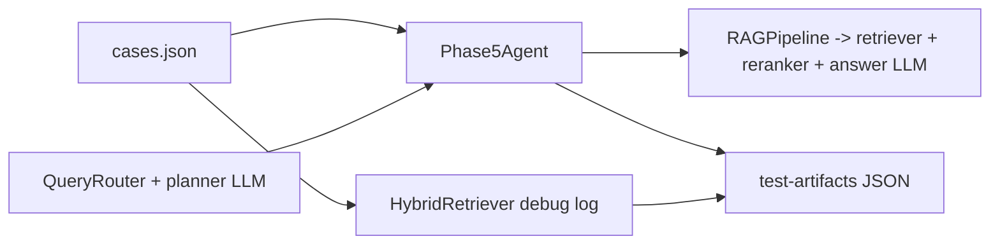

# Live RAG Evaluation Harness

Opt-in harness that drives the **real router + RAG pipeline** against an LLM and writes
structured JSON artifacts for manual review. RAG output is non-deterministic, so the
runner deliberately avoids exact-string matching on answers; automated checks are
**structural only** and routing mismatches are logged as warnings, never hard failures.

- Cases: [`tests/rag_eval/cases.json`](cases.json)
- Schema helpers: [`tests/rag_eval/artifact_schema.py`](artifact_schema.py)
- Runner: [`tests/rag_eval/run_eval.py`](run_eval.py)
- PowerShell wrapper: [`tests/rag_eval/run_rag_eval.ps1`](run_rag_eval.ps1)
- Pytest wrapper: [`factory-agent/tests/test_rag_live_llm.py`](../../factory-agent/tests/test_rag_live_llm.py)
- Artifacts: `test-artifacts/rag-eval/<run_id>/` (gitignored, mirroring [`tests/e2e/README.md`](../e2e/README.md))

## Prerequisites

1. **Ingest the corpus once** so `HybridRetriever` has a vector DB and BM25 index.
   Run from the **repo root** (the module resolves `rag_sources/source_register.json`
   relative to the current directory):

   ```powershell
   cd <repo-root>
   python -m factory_agent.rag.ingestion
   ```

   Or use [`run_rag_eval.ps1`](run_rag_eval.ps1) with `-Ingest` (it `cd`s to repo root first).

   The default register points at [`rag_sources/source_register.json`](../../rag_sources/source_register.json)
   which references `SOP-LOTO-001` →
   [`rag_sources/01_emas_internal_docs/scheduling/loto_procedure.md`](../../rag_sources/01_emas_internal_docs/scheduling/loto_procedure.md).
   Note: ingestion reads UTF-8 text directly, so PDFs must be exported to `.md`/`.txt`
   first (see [`eMAS_RAG_Implementation_Plan.md`](../../eMAS_RAG_Implementation_Plan.md)).

2. **Configure the LLM**. The harness reuses `factory_agent.config.get_settings()`, so
   any of the existing env files (`.env`, `factory-agent/.env`) work. At minimum:

   ```powershell
   $env:OPENAI_BASE_URL = "http://127.0.0.1:900/v1"
   $env:OPENAI_API_KEY  = "local"
   # optional per-role overrides used by build_planner_chat_model / build_rag_answer_chat_model
   ```

3. **Opt in**:

   ```powershell
   $env:FACTORY_AGENT_LIVE_RAG = "1"   # or FACTORY_AGENT_LIVE_LLM=1
   ```

## Running

### PowerShell wrapper

From the repo root (or anywhere — the script resolves repo root):

```powershell
.\tests\rag_eval\run_rag_eval.ps1 -Ingest
.\tests\rag_eval\run_rag_eval.ps1
.\tests\rag_eval\run_rag_eval.ps1 -Filter loto-
.\tests\rag_eval\run_rag_eval.ps1 -Action Pytest -Filter loto-
```

Parameters: `-Ingest`, `-Action RunEval|Pytest`, `-Filter`, `-RunId`, `-OpenAiBaseUrl`,
`-OpenAiApiKey`, `-PythonExe`, `-NoCleanup`. Defaults match local `llama-server` on `:900`.

### CLI

```powershell
# from repo root
python -m tests.rag_eval.run_eval

# subset by case id substring:
python -m tests.rag_eval.run_eval --filter loto-
python -m tests.rag_eval.run_eval --filter router-

# pin a run id (useful for diffs):
python -m tests.rag_eval.run_eval --run-id 2026-05-10-baseline
```

### Pytest

```powershell
python -m pytest factory-agent/tests/test_rag_live_llm.py -v
# optional case filter:
$env:FACTORY_AGENT_RAG_EVAL_FILTER = "loto-"
python -m pytest factory-agent/tests/test_rag_live_llm.py -v
```

When the env flag is unset the test is `SKIPPED`, so it is safe to leave in the suite.

## What the harness exercises



`Phase5Agent` is wired with the real `QueryRouter` and `RAGPipeline`, but the executor
is **stubbed** (this harness focuses on routing + RAG; end-to-end execution coverage
lives in [`tests/e2e`](../e2e/README.md)). For each case the runner additionally calls
`HybridRetriever.retrieve` once with `route="RAG_ONLY"` to log the top retrieved chunks
for debug-only review. This duplicates retrieval work; if it ever becomes costly,
add a debug hook on `RAGPipeline` and remove the second call.

## Artifact layout

```
test-artifacts/
  rag-eval/
    <run_id>/
      summary.json
      <case_id>.json     # one per case
```

Per-case fields (full schema in
[`artifact_schema.py`](artifact_schema.py) `build_case_artifact`):

| Field | Purpose |
|---|---|
| `run_id`, `case_id`, `started_at`, `finished_at`, `duration_s` | run/case metadata |
| `env` | non-secret fingerprint (model ids, base URL **host only**) |
| `case` | original entry from `cases.json` for self-contained review |
| `query` | exact prompt sent to the agent |
| `route_decision` | full router dict (`route`, `route_source`, `confidence`, `scores`, `signals`, `clarify_reason`, …) |
| `rag` | `answer`, `sources`, `safety_warning`, `route_used` (only when route is RAG-bearing) |
| `agent_response` | full `AgentResponse` (answer/sources/route/metadata) |
| `retrieval_debug` | top chunks (`chunk_id`, `doc_id`, scores, `snippet`) — debug-only |
| `automated.checks` | structural checks with `severity = fail` or `warn` |
| `automated.errors` / `automated.warnings` | flat lists for triage |
| `manual_evaluation` | `{score, dimensions, reviewer_notes}` placeholders for you |
| `error` | exception trace if the harness itself blew up |

`summary.json` aggregates per-case `route` / `route_source` / `automated_ok` /
`warnings` / `errors` plus run totals.

## Automated checks (structural only)

| id | severity | description |
|---|---|---|
| `harness_no_exception` | fail | no unhandled error from the agent run |
| `answer_non_empty` | fail | `agent_response.answer` is a non-empty string |
| `rag_sources_present` | fail | RAG-bearing route returned ≥1 citation when `expects_sources` is true |
| `rag_route_used` | warn | case expected RAG citations but routing skipped RAG |
| `expected_doc_ids_cited` | warn | at least one expected `doc_id` appears in citations |
| `routing_acceptable` | warn | observed route is in the case's `acceptable` set |
| `routing_preferred` | warn | observed route matches the `preferred` set |
| `do_not_use_for_excluded` | fail | top retrieved chunk does not violate a `do_not_use_for` cue tagged on the case |

Routing checks are warnings because the router falls back to `_llm_classify` on
ambiguous queries (`route_source = "llm"`), which is non-deterministic.

## Manual evaluation workflow

1. Run the harness and find the new `test-artifacts/rag-eval/<run_id>/` folder.
2. Open `summary.json` to triage which cases passed structural checks and which
   produced warnings.
3. For each `<case_id>.json`, read `query` → `route_decision` → `agent_response.answer`
   → `rag.sources` → `retrieval_debug.top_chunks`.
4. Fill in `manual_evaluation` (in-place edit) with your scoring scheme. Suggested
   shape:

   ```json
   "manual_evaluation": {
     "score": 4,
     "dimensions": {
       "faithfulness": 5,
       "completeness": 4,
       "citation_accuracy": 4,
       "safety_compliance": 5
     },
     "reviewer_notes": "answer correct; missed citing section 2.2"
   }
   ```

5. Commit reviewed artifacts elsewhere if you want a paper trail (the
   `test-artifacts/` folder itself stays gitignored — see [`.gitignore`](../../.gitignore)).

## Adding more cases or documents

- **More cases**: append entries to `cases.json` with a unique `id`, the `query`,
  any `routing_expectation` (soft), `expects_sources`, and `expected_doc_ids`.
- **More documents**: drop `.md` files under `rag_sources/` and add an entry to
  [`rag_sources/source_register.json`](../../rag_sources/source_register.json), then
  re-run ingestion. With only the LOTO doc registered today, retrieval diversity is
  limited; adding 1–2 more docs makes `expected_doc_ids_cited` checks meaningful.
